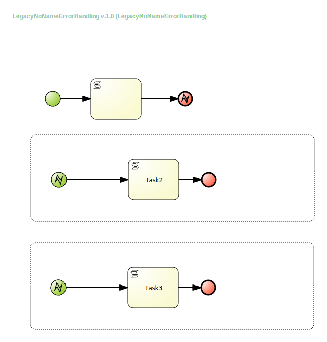
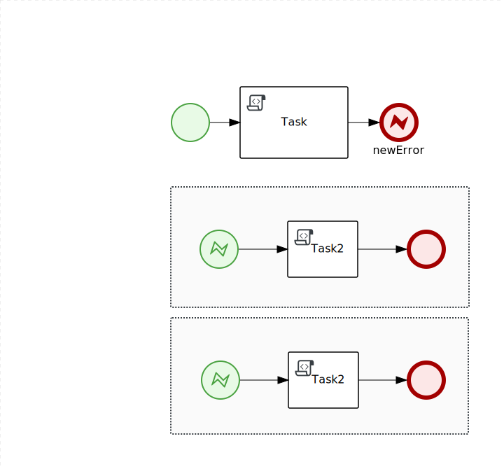

Repository to test difference how Lecacy and new BPMN designers handle empty Error Events

## LegacyNoNameErrorHandling


### Legacy XML
```xml
<bpmn2:error id="_3dd11b62-6f7c-4822-ae03-953631f71677"/>
<bpmn2:error id="_820fae4e-469e-3708-8872-bb1244a3b6b1" errorCode="errorName" name="errorName"/>


<bpmn2:endEvent id="_7CEA5467-DD75-4F39-9B13-8E614E2E5855" name="">
    <bpmn2:errorEventDefinition id="_7V1b1dx-Eeq6zIW9vDTNXw" drools:erefname="errorName" errorRef="_820fae4e-469e-3708-8872-bb1244a3b6b1"/>
</bpmn2:endEvent>

<bpmn2:subProcess>
    <bpmn2:startEvent id="_E8E7E013-E51B-467E-9E96-CA457CEE4030" name="">
        <bpmn2:errorEventDefinition id="_7V1b1Nx-Eeq6zIW9vDTNXw" errorRef="_3dd11b62-6f7c-4822-ae03-953631f71677"/>
    </bpmn2:startEvent>
</bpmn2:subProcess>

<bpmn2:subProcess>
    <bpmn2:startEvent id="_F6777F3F-31A5-46D8-84AC-BE714F939DF3" name="">
        <bpmn2:errorEventDefinition id="_7V1b2dx-Eeq6zIW9vDTNXw" errorRef="_3dd11b62-6f7c-4822-ae03-953631f71677"/>
    </bpmn2:startEvent>
</bpmn2:subProcess> 
```

## StunnerNoNameErrorHandling

### New XML
```xml
<bpmn2:error id="_0DE22AA6-09D8-488C-9DCC-82CFA510F414"/>
<bpmn2:error id="_DB385710-A715-45C8-A421-510C93179FB7"/>
<bpmn2:error id="newError" errorCode="newError"/>
<bpmn2:endEvent id="_2BC375A0-4A8B-44CA-AE1C-3072028EC40D" name="newError">
    <bpmn2:errorEventDefinition id="_2KWjgdyAEeq6zIW9vDTNXw" drools:erefname="newError" errorRef="newError"/>
</bpmn2:endEvent>

<bpmn2:subProcess>
    <bpmn2:startEvent id="_247D3839-E526-42A6-8BCC-00C1B7433ADA">
        <bpmn2:errorEventDefinition id="_2KWjgtyAEeq6zIW9vDTNXw" errorRef="_DB385710-A715-45C8-A421-510C93179FB7"/>
    </bpmn2:startEvent>
</bpmn2:subProcess>

<bpmn2:subProcess>
    <bpmn2:startEvent id="_E8E7E013-E51B-467E-9E96-CA457CEE4030">
        <bpmn2:errorEventDefinition id="_2KWjg9yAEeq6zIW9vDTNXw" errorRef="_0DE22AA6-09D8-488C-9DCC-82CFA510F414"/>
    </bpmn2:startEvent>
</bpmn2:subProcess>
```
